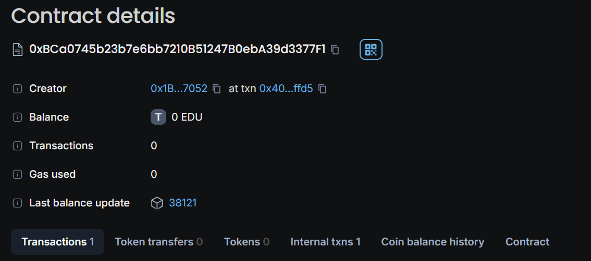

# Crowdfunding Smart Contract

## Vision

The Crowdfunding Smart Contract aims to provide a decentralized platform where users can create, contribute to, and manage crowdfunding projects on the Ethereum blockchain. This project leverages blockchain technology to ensure transparency, security, and efficiency in managing contributions and funds.

## Project Features

- **Create Projects**: Users can create new crowdfunding projects by specifying a project ID, goal amount, and duration. Each project is uniquely identified by its ID.
- **Contribute to Projects**: Users can contribute Ether to projects by specifying the project ID and the amount they wish to contribute.
- **Withdraw Funds**: Project creators can withdraw funds if the project's funding goal is met. Funds can only be withdrawn by the project creator.
- **Refunds**: Contributors can request refunds if the project fails to meet its funding goal by the deadline.
- **View Project Details**: Users can view the details of a project, including the creator, goal amount, total contributions, deadline, and the funding status.

## Future Scope

- **Enhanced Features**: Integrate additional features such as reward tiers, where contributors receive specific rewards based on their contribution levels.
- **Analytics Tools**: Implement analytics tools to track and analyze project performance, funding trends, and contributor demographics.
- **Communication Forums**: Create forums or chat functionalities to facilitate communication between project creators and contributors.
- **Governance Mechanisms**: Explore the addition of decentralized governance mechanisms for decision-making within projects.

## Project Structure

1. **Smart Contract**:
   - **Crowdfunding.sol**: The main Solidity contract that handles project creation, contributions, fund withdrawals, refunds, and viewing project details.

2. **Smart Contract Functions**:
   - `createProject(uint256 _projectId, uint256 _goalAmount, uint256 _durationInDays)`: Allows users to create a new project.
   - `contribute(uint256 _projectId, uint256 _amount)`: Allows users to contribute Ether to a project.
   - `withdrawFunds(uint256 _projectId)`: Allows project creators to withdraw funds if the goal is met.
   - `refund(uint256 _projectId)`: Allows contributors to get a refund if the project fails to meet its goal.
   - `getProjectDetails(uint256 _projectId)`: Returns the details of a specific project.

3. **State Variables**:
   - `projectCount`: Tracks the number of projects created.
   - `projects`: Maps project IDs to project details.
   - `contributors`: Maps project IDs and contributor addresses to their contribution amounts.

4. **Events**:
   - `ProjectCreated`: Emitted when a new project is created.
   - `ContributionReceived`: Emitted when a contribution is made to a project.
   - `FundsWithdrawn`: Emitted when funds are withdrawn by a project creator.
   - `RefundIssued`: Emitted when a refund is issued to a contributor.
   - `ProjectCompleted`: Emitted when a project is marked as completed.

## Developer Details

- **Developer Name**: Risa Chaudhari
- **Contact**: risa.chaudhari@gmail.com

## Deployment
- **Chain name**: EduChain Open
- **Campus contract id**:0xbca0745b23b7e6bb7210b51247b0eba39d3377f1
- **snapshot**: 
